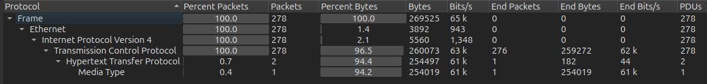
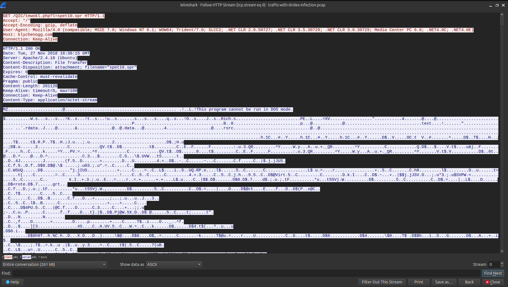
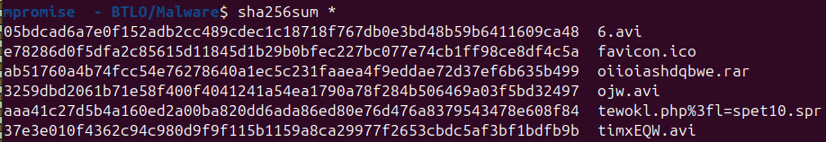
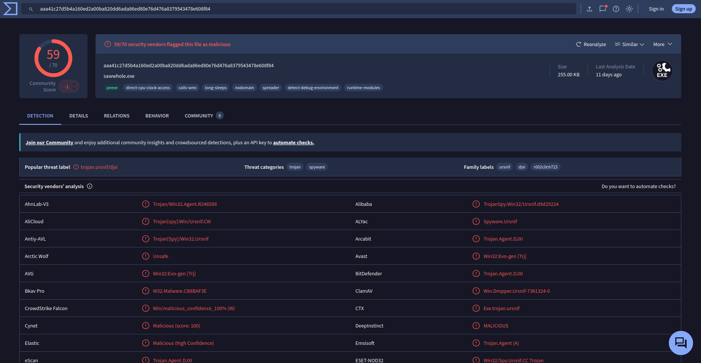
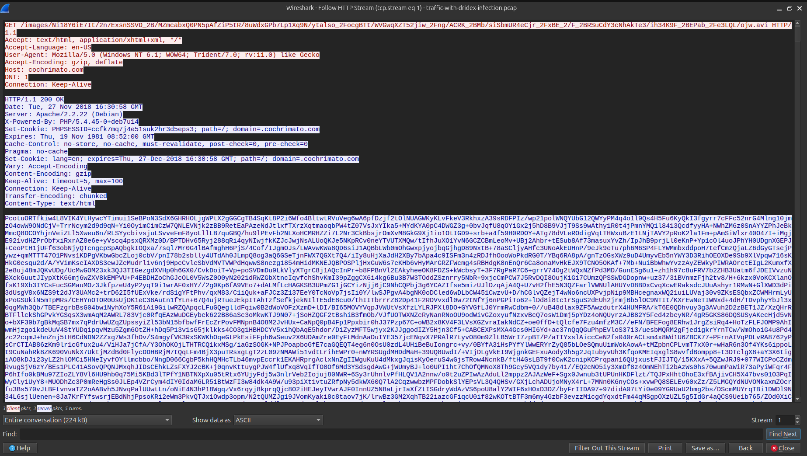

# BTLO — Network Analysis: Malware Compromise

- **Platform:** Blue Team Labs Online (BTLO)
- **Category:** Network Analysis
- **Difficulty:** Medium
- **Primary Tool:** Wireshark
- **Additional Tool:** Brim / Zui
- **Evidence:** PCAP

---

## Overview

This investigation involved analyzing a PCAP captured from an employee workstation after a suspicious macro-enabled invoice document was opened.

The objective was to identify the infected host, trace the malware delivery process, identify malicious infrastructure, and determine the post-infection communication associated with the malware.

---

## Scenario

A SOC analyst receives an alert indicating that an internal workstation is communicating with a known malicious domain.

The workstation belongs to an accountant who receives a large number of customer emails. The user reported opening an invoice containing a macro-enabled document. Shortly after opening the document, the application crashed.

A PCAP was provided for network investigation.

---

## Investigation

### 1. PCAP Overview

The capture was first reviewed through Wireshark's `Statistics → Capture File Properties`.

The capture covers approximately 42 minutes of network activity. The time display was configured to UTC to maintain consistent timestamps during the investigation.

### 2. Protocol Analysis

Using `Statistics → Protocol Hierarchy`, traffic was dominated by TCP, with HTTP accounting for the large majority of transferred bytes.



This pointed the investigation toward the HTTP traffic first. DNS resolutions and TLS-encrypted sessions were examined in later stages, once relevant domains and destination IPs had been identified — giving the overall investigation path: **HTTP → Domain/DNS correlation → TLS**.

### 3. Identifying the Infected Host

IPv4 conversations were reviewed under `Statistics → Conversations → IPv4`.

The internal host generating significant external traffic was:

```
10.11.27.101
```

This was identified as the infected workstation.

### 4. Initial Malware Retrieval

HTTP traffic was filtered and the early packets were reviewed.

Packet 6 contained an HTTP GET request attempting to retrieve `spet10.spr`. The request's `Host` header identified the delivery domain as `klychenogg.com`. Following the HTTP stream revealed an `MZ` header and the characteristic Windows executable message:

```
This program cannot be run in DOS mode.
```

This indicated that the downloaded file was a Windows Portable Executable despite its `.spr` extension.



The extracted binary was hashed to confirm its identity and support threat-intelligence lookups:

```
SHA-256: aaa41c27d5b4a160ed2a00ba820dd6ada86ed80e76d476a8379543478e608f84
```



Submitting the hash to VirusTotal confirmed the file as malicious, with 59 out of 70 security vendors flagging it and the popular threat label `trojan.ursnif/djxi`.



**Malware binary:** `spet10.spr`
**Delivery domain:** `klychenogg.com`

### 5. Suspicious HTTP Infrastructure

Traffic involving `176.32.33.108` was investigated. Packet 288 contained an HTTP request to `/images/`, associated with the domain:

```
cochrimato.com
```



This domain was identified as suspicious during threat-intelligence investigation.

### 6. Follow-up Malware Download

Further HTTP traffic involving `95.181.198.231` was examined. Packet 911 contained a request for a `.rar` archive. Following the HTTP stream revealed the complete URI:

```
http://95.181.198.231/oiioiashdqbwe.rar
```

This represented a follow-up malware retrieval stage.

### 7. Post-Infection Traffic

Investigation then focused on traffic to `185.244.150.230`. The communication was encrypted using TLS. The TLS Client Hello packets were inspected to identify available metadata such as the SNI field.

Additional investigation using Brim/Zui revealed IDS-related alerts associated with malicious SSL infrastructure and Dridex activity.

The post-infection traffic was therefore associated with `185.244.150.230`.

---

## Indicators of Compromise

| Type | Indicator |
|---|---|
| Infected Host | `10.11.27.101` |
| Initial Delivery Domain | `klychenogg.com` |
| Malware Binary | `spet10.spr` |
| Malware Binary SHA-256 | `aaa41c27d5b4a160ed2a00ba820dd6ada86ed80e76d476a8379543478e608f84` |
| Malicious Domain | `cochrimato.com` |
| Malware Download IP | `95.181.198.231` |
| Follow-up Malware | `oiioiashdqbwe.rar` |
| Follow-up Malware SHA-256 | `ab51760a4b74fcc54a76278640a1ec5c231faaea4f9eddae72d37ef6b635b499` |
| Post-Infection IP | `185.244.150.230` |

> The `.rar` URL is documented as an IOC for investigation purposes only. It should not be accessed directly.

---

## Attack Timeline

```
Malicious invoice
      ↓
Macro-enabled document
      ↓
User opens document
      ↓
spet10.spr retrieved (klychenogg.com)
      ↓
Suspicious HTTP communication (cochrimato.com)
      ↓
Follow-up .rar download
      ↓
Dridex infection
      ↓
Post-infection communication (185.244.150.230)
```

---

## Key Findings

1. The infected workstation as `10.11.27.101`.
2. An initial malware download named `spet10.spr`, delivered from `klychenogg.com` and confirmed malicious via VirusTotal (59/70 vendors, `trojan.ursnif/djxi`).
3. Suspicious HTTP communication with `cochrimato.com`.
4. A follow-up malware archive retrieved from `95.181.198.231`.
5. Post-infection communication with `185.244.150.230`.
6. Network evidence consistent with a Dridex infection following an Ursnif infection stage.

---

## Skills Demonstrated

PCAP analysis · Wireshark · Network traffic analysis · IPv4 conversation analysis · DNS analysis · HTTP analysis · TCP analysis · TLS/SNI analysis · Malware download identification · IOC extraction · File-type identification · SHA-256 hashing · Threat intelligence · Brim/Zui · Attack timeline reconstruction

---

## Lessons Learned

- Start with an overview of the PCAP before investigating individual packets.
- Use network conversations to identify important hosts and external connections.
- HTTP traffic can expose malware downloads and attacker infrastructure.
- File extensions cannot be trusted without inspecting the actual file content.
- Encrypted traffic can still expose useful metadata through TLS handshakes.
- Combining Wireshark with network-monitoring tools such as Brim/Zui can provide additional detection context.
- Individual indicators become much more valuable when correlated into an attack timeline.

---

## Conclusion

The investigation reconstructed the main stages of the infection from network evidence and extracted several useful indicators of compromise. The challenge provided practical experience in moving from raw packet data to a structured incident investigation and IOC set.
